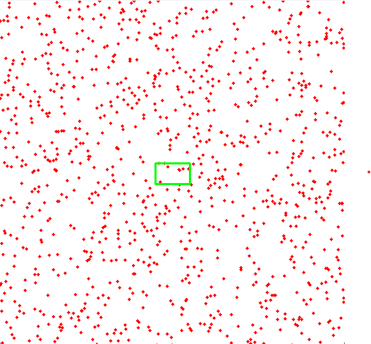
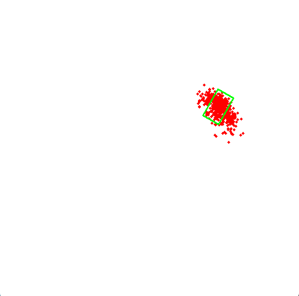
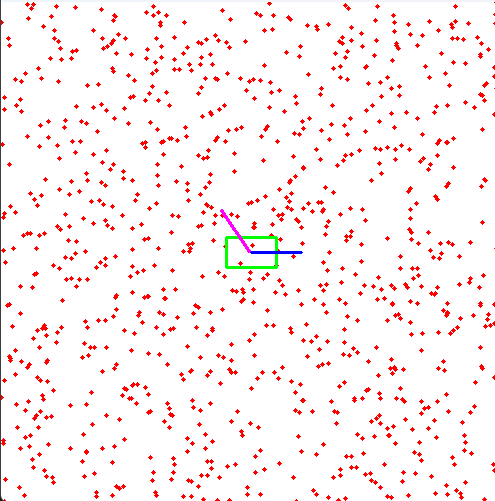
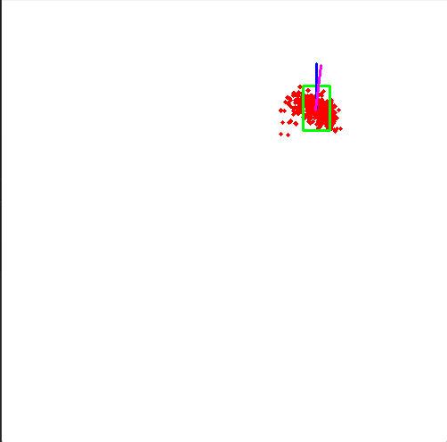
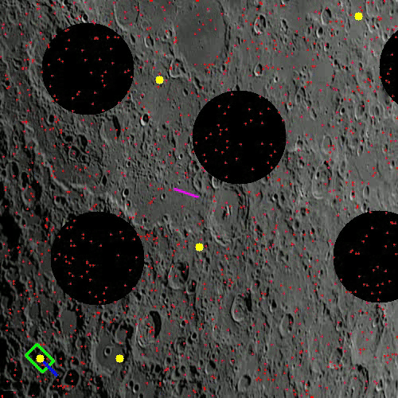

# Lunar Navigator Robot using Particle Filters

## Implementation

Initially the robot is initialized with the particles estimating just the location:

Initialized particles

Final particle location 

This can be tested by running **pf1.py** which allows you to drive the robot around freely using keyboard buttons

Then, the pose of the robot is initialized along the line of the robot body and the location and the particle filter tracks both:

Initialized particles

Final particle location

The use case of this system is when a rover has to navigate on the moon, the upper rocket uses a camera to capture an overhead picture of the environment with a rough understanding of the start and end points. Along with this, the craters are tracked and stored as obstacles, with waypoints marked. The system tracks the robot location and pose using particle filters for onboard localization and better environmental understanding.

A simulation of autonomous robot navigation on lunar terrain using particle filter localization. The simulation detects craters as obstacles from actual lunar surface imagery and demonstrates path planning with obstacle avoidance.
Features
Real-time crater detection from lunar surface images using computer vision
Particle filter-based robot localization
Dynamic obstacle avoidance
Waypoint-based navigation
Trajectory visualization
Video recording of simulation

## Additional Resources

For a deeper understanding of Particle Filters and its implementation, you can refer to the following resources:

- [Particle Filters - Wikipedia](https://en.wikipedia.org/wiki/Particle_filter)
- [Particle Filters Tutorial - Coursera](https://www.coursera.org/learn/robotics-perception)

